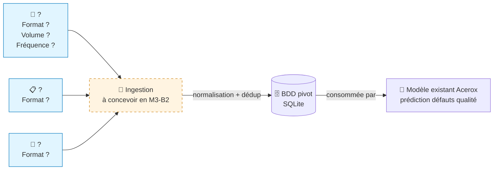

# Schéma des flux de données — Acerox Métallurgie

> Schéma Mermaid à compléter. Doit montrer :
> - **Sources** (capteurs IoT, ERP, logs, *bonus PDF*)
> - **Ingestion** (à concevoir en M3-B2)
> - **BDD pivot** (à modéliser en M3-B2)
> - **Modèle existant** Acerox (placeholder, hors-sujet ici)
>
> Légende explicite : qui produit, qui consomme, contraintes.

## Schéma

## Légende

> Reformule en 5 lignes max ce que le schéma raconte (qui produit quelle
> donnée, qui consomme, contraintes critiques).

- **Producteur** : ...
- **Consommateur final** : ...
- **Contraintes critiques** (fréquence / RGPD / qualité) : ...

## Décisions associées

- Source(s) retenues en priorité : ...
- Source(s) écartées : ...
- Source bonus (PDF) traitée ? oui / non, pourquoi : ...

---

*Schéma produit par <prénom>, <date>, dans le cadre du brief M3-B1 ATOS.*
