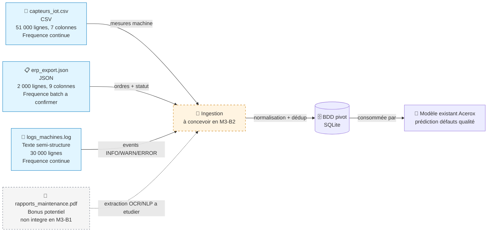

# Schéma des flux de données — Acerox Métallurgie

> Schéma Mermaid à compléter. Doit montrer :
> - **Sources** (capteurs IoT, ERP, logs, *bonus PDF*)
> - **Ingestion** (à concevoir en M3-B2)
> - **BDD pivot** (à modéliser en M3-B2)
> - **Modèle existant** Acerox (placeholder, hors-sujet ici)
>
> Légende explicite : qui produit, qui consomme, contraintes.

## Schéma

## Légende

> Reformule en 5 lignes max ce que le schéma raconte (qui produit quelle
> donnée, qui consomme, contraintes critiques).

- **Producteurs** : capteurs atelier (IoT), systeme ERP, systeme de logs machines.
- **Consommateur final** : modele existant Acerox de prediction des defauts qualite, alimente via la BDD pivot.
- **Contraintes frequence** : IoT et logs en continu, ERP en batch (cadence exacte a confirmer).
- **Contraintes qualite** : doublons IoT, valeurs manquantes sur `vibration_mms` et `ouvrier_id`, logs a parser proprement.
- **Contraintes RGPD** : risque indirect de re-identification via `ouvrier_id` en croisement multisources.

## Décisions associées

- Source(s) retenues en priorité : `capteurs_iot.csv` et `erp_export.json`.
- Source(s) écartées : aucune source completement ecartee; `logs_machines.log` est reportee en phase 2.
- Source bonus (PDF) traitée ? non, car hors perimetre M3-B1 et necessite une extraction textuelle specifique.

---

*Schéma produit par Theo, 30/06/2026, dans le cadre du brief M3-B1 ATOS.*
