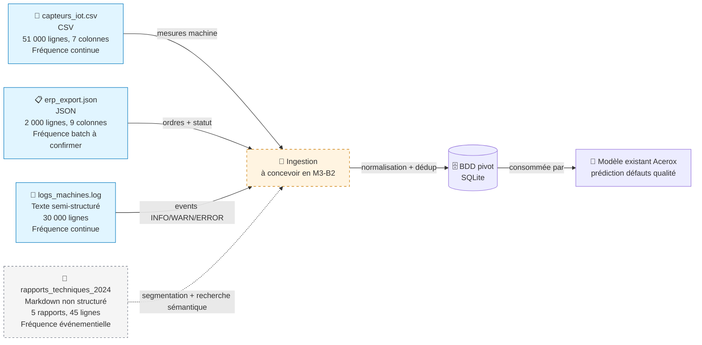

# Schéma des flux de données — Acerox Métallurgie

> Schéma Mermaid à compléter. Doit montrer :
> - **Sources** (capteurs IoT, ERP, logs, *bonus PDF*)
> - **Ingestion** (à concevoir en M3-B2)
> - **BDD pivot** (à modéliser en M3-B2)
> - **Modèle existant** Acerox (placeholder, hors-sujet ici)
>
> Légende explicite : qui produit, qui consomme, contraintes.

## Schéma

## Légende

> Reformule en 5 lignes max ce que le schéma raconte (qui produit quelle
> donnée, qui consomme, contraintes critiques).

- **Producteurs** : capteurs atelier (IoT), système ERP, système de logs machines et rapports techniques rédigés après incident/intervention.
- **Consommateur final** : modèle existant Acerox de prédiction des défauts qualité, alimenté via la BDD pivot.
- **Contraintes fréquence** : IoT et logs en continu, ERP en batch (cadence exacte à confirmer).
- **Contraintes qualité** : doublons IoT, valeurs manquantes sur `vibration_mms` et `ouvrier_id`, logs à parser proprement, rapports à segmenter avant exploitation.
- **Contraintes RGPD** : risque indirect de ré-identification via `ouvrier_id` et présence possible d'identifiants opérateur dans les rapports techniques.

## Décisions associées

- Source(s) retenues en priorité : `capteurs_iot.csv` et `erp_export.json`.
- Source(s) écartées : aucune source complètement écartée ; `logs_machines.log` est reportée en phase 2.
- Source bonus / complémentaire traitée ? oui : `rapports_techniques_2024`, à valoriser surtout pour la recherche sémantique et l'aide au diagnostic.

---

*Schéma produit par Théo, 30/06/2026, dans le cadre du brief M3-B1 ATOS.*
