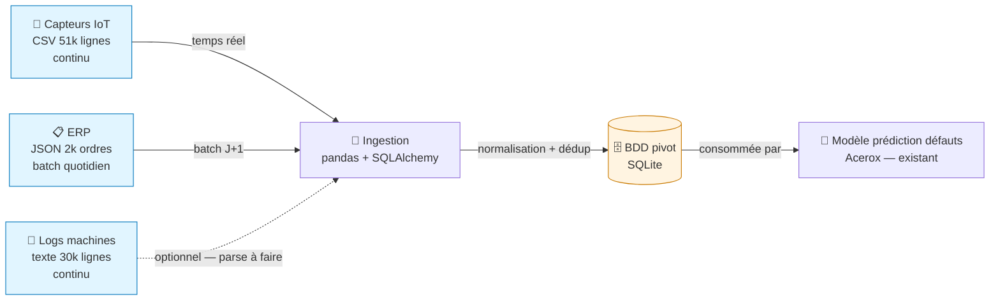
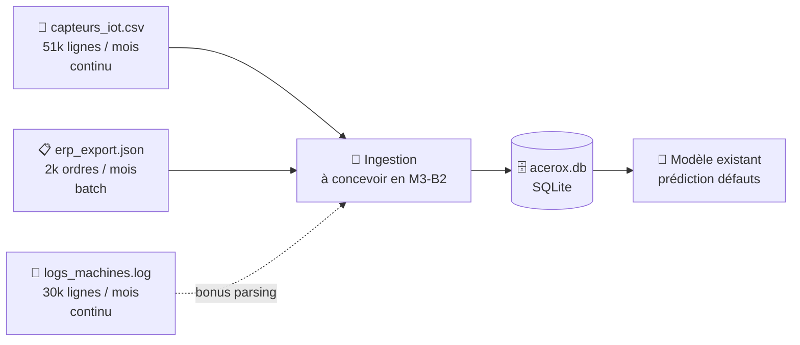

# Schéma Mermaid des flux de données — Mini-cours

> Brief associé : M3-B1
> Durée de lecture + pratique : ~15 min
> Pré-requis : avoir identifié les sources retenues (cf. mini-cours 02).

## Pourquoi cette techno ?

Un **schéma de flux de données** dit en 1 image ce qu'un texte met
3 pages à expliquer :
- **Quelles sources** alimentent le système
- **Comment** elles convergent (ingestion, normalisation, dédoublonnage)
- **Où** elles aboutissent (BDD, modèle)
- **Quelles contraintes** s'appliquent (RGPD, fréquence)

C'est le **livrable visuel** de M3-B1. Sans lui, ta note d'identification
est moins lisible pour un décideur métier.

**Pourquoi Mermaid** :
- Syntaxe **textuelle** (pas de logiciel WYSIWYG)
- **Rendu automatique** sur GitHub, GitLab, Notion, Obsidian, beaucoup d'IDE
- **Versionnable** (Git diff sur le code Mermaid = trace des changements)
- Tu l'as déjà vu en **M1-B2** (schéma archi API) — on capitalise

**Alternatives à connaître :**

| Outil | Quand l'utiliser ? |
|---|---|
| **Mermaid** | Notre M3-B1 — markdown, GitHub-friendly, versionnable |
| **draw.io / diagrams.net** | Plus libre, mais image binaire (pas Git-friendly) |
| **PlantUML** | Plus puissant, mais demande un serveur ou une install |
| **Excalidraw** | Sketch collaboratif live — utilisé pour le mur réflexif, pas pour livrables |
| **Lucidchart / Miro** | SaaS, intéressants pour ateliers, pas adaptés à un repo Git |

## Concepts clés

- **Diagramme flowchart** : `flowchart LR` (left-right) ou `flowchart TD`
  (top-down). LR souvent meilleur pour des flux de données.
- **Boîte** : `ID[Texte]` (rectangle), `ID[(Texte)]` (cylindre — utilisé
  pour les BDD), `ID((Texte))` (cercle), `ID{Texte}` (losange — décision).
- **Flèche** : `A --> B` (pleine), `A -.->|étiquette| B` (pointillée).
  L'étiquette dit **quoi passe entre A et B**.
- **`subgraph`** : groupement (utile pour distinguer ingestion / BDD /
  modèle).
- **`classDef`** : styles personnalisés (couleurs) pour distinguer
  sources / transformations / artefacts.

## Exemple minimal qui tourne

Rends-le **sur GitHub** : copie-colle dans un `.md`, push, GitHub render
automatiquement. Si tu veux un PNG : `npx -p @mermaid-js/mermaid-cli mmdc -i flux.mmd -o flux.png`.

## Exercice guidé (tâche 4 du brief)

Dans `flux_donnees.md` :

1. Repars du squelette Mermaid fourni
2. Mets à jour les **3 sources** avec leurs vraies caractéristiques
   (format / volume / fréquence)
3. Distingue par **style** ce qui existe (sources, modèle) de ce qui est
   à construire (ingestion en M3-B2 → en pointillé ou couleur différente)
4. Écris la **légende** en 5 lignes max sous le schéma

**Solution attendue (extrait)** :

## Ton schéma raconte le *data lineage*

Ce que tu dessines a un nom métier : le **data lineage** (la traçabilité de la
donnée, *source → exploitation*). C'est exactement l'item syllabus *« documenter
le flux et la chaîne d'approvisionnement des données »*. Un bon schéma ne montre
pas que des flèches — il **annote chaque source** avec son **cycle de vie** :

| À annoter par source | Pourquoi c'est du lineage |
|---|---|
| **Provenance** (qui/quoi la produit) | savoir à qui réclamer une correction |
| **Fraîcheur / fréquence** (temps réel, batch quotidien…) | savoir si la donnée est à jour au moment du scoring |
| **Version** (schéma v1, export du JJ/MM) | reproductibilité : rejouer la pipeline sur le même état |
| **Transformations subies** (nettoyage, dédup) | comprendre ce qui sépare la donnée brute de celle ingérée |

> 💡 Tu n'as **pas** besoin d'un outil de lineage (OpenLineage, Marquez…) en
> M3 — juste le **réflexe** d'annoter ces 4 infos. L'outillage, c'est plus tard.

## Pièges fréquents

| Piège | Conséquence |
|---|---|
| Schéma sans légende | Le décideur ne sait pas lire — toujours 3-5 lignes de légende |
| Trop de boîtes (15+) | Devient illisible — vise 5-10 boîtes max |
| Code Mermaid non rendu sur GitHub | Vérifie ton fichier `.md` sur l'interface GitHub |
| Boîtes sans volume / fréquence | Tu rates l'info pratique pour le décideur |
| Pas de distinction existant / à construire | Le client pense que tout existe déjà |
| Flèches sans étiquette | Le lecteur devine ce qui passe entre 2 boîtes — précise |

**Symptôme → cause probable** :

| Symptôme | Cause probable |
|---|---|
| GitHub n'affiche pas le diagramme | Code Mermaid avec une faute de syntaxe — copie-colle dans <https://mermaid.live> pour debug |
| Mermaid crash sur des accents | Évite les accents dans les IDs de boîtes (les libellés acceptent) |
| Les couleurs ne s'appliquent pas | `classDef` doit être *avant* le `class`, et les IDs doivent matcher exactement |
| Flèche `-.->` ne marche pas | Vérifie l'ordre des points — pointillé c'est `-.->`, pas `..->` |

## Pour aller plus loin

- **Mermaid — *Flowchart Syntax*** : <https://mermaid.js.org/syntax/flowchart.html>
- **Mermaid Live Editor** : <https://mermaid.live> (debug rapide)
- **GitHub — *Creating diagrams in Markdown*** : <https://docs.github.com/fr/get-started/writing-on-github/working-with-advanced-formatting/creating-diagrams>

## Vérification (checklist apprenant)

- [ ] Mon `flux_donnees.md` contient un schéma Mermaid **rendu** (vérifié
      sur GitHub ou Mermaid Live)
- [ ] Mes 3 sources retenues sont **toutes** dans le schéma
- [ ] J'ai distingué visuellement **existant** vs **à construire**
- [ ] Chaque flèche a une **étiquette** explicite
- [ ] J'ai écrit une **légende** de 3-5 lignes sous le schéma
- [ ] Un décideur métier qui regarde 1 minute comprend le flux global
